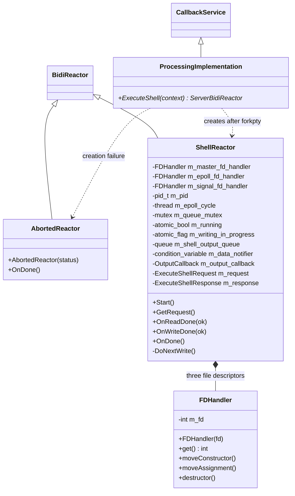
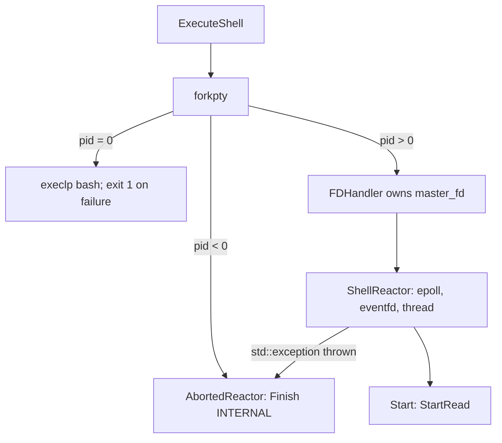
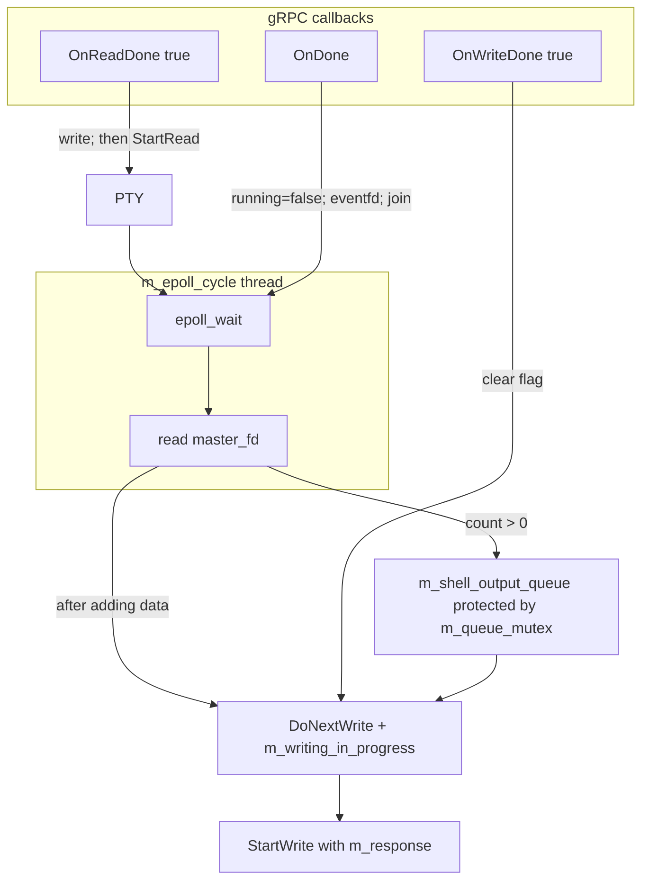

# Agent
**Status:** Active / Prototyping

## Architecture
> ⚠ Architecture is currently under active development and may change significantly between revisions.

## Structural diagram

`CallbackService` is the generated `Agent::ShellControllerService::CallbackService`. `BidiReactor` is shorthand for `grpc::ServerBidiReactor<Agent::ExecuteShellRequest, Agent::ExecuteShellResponse>`. The names `moveConstructor`, `moveAssignment`, and `destructor` in the diagram denote C++ special member functions, not additional methods in the code. Copying `FDHandler` is prohibited; moving transfers the file descriptor and sets it to `-1` in the source object; the destructor closes the file descriptor.

## Mapping between HLD and code

| HLD block | Implementation | Scope of responsibility |
|---|---|---|
| gRPC service | `main.cc`, `ProcessingImplementation` | Server creation, service registration, process and reactor creation |
| Shell controller | `ShellReactor` | Byte transfer between gRPC and the pseudoterminal (PTY) |
| Child bash process | `forkpty` → `execlp` | A separate process, not an Agent class |
| gRPC client | `agent.proto` | External party; this module has no client implementation |

## Contract

`ExecuteShell(stream ExecuteShellRequest) returns (stream ExecuteShellResponse)`.

| Message | Field | Actual usage |
|---|---|---|
| `ExecuteShellRequest` | `string command` | Bytes are written to the PTY master file descriptor; the code does not append a newline |
| `ExecuteShellResponse` | `string output` | Set from the output queue |
| `ExecuteShellResponse` | `bool success` | Not set by the implementation |

The server listens on `0.0.0.0:50051` with `InsecureServerCredentials()`. Client verification and command restrictions are not implemented. Documentation claims about encrypted requests and validated commands do not reflect this code snapshot.

## Session creation

Before starting the server, `main` sets `SIGCHLD = SIG_IGN` with `SA_NOCLDWAIT`. `AbortedReactor::OnDone()` deletes its own object. `m_pid` is stored but is not subsequently used to manage the process.

## Threads and data transfer

`DoNextWrite()` allows a single sender through an atomic flag. An empty queue clears the flag. Non-empty data is passed to `StartWrite` if `m_output_callback` is not set. The constructor supports an alternative handler, but the running service does not supply one. `m_data_notifier` is notified, but nothing in the code waits on it. The result of `write()` in `OnReadDone`, including partial writes, is not handled.

## Scope limitations and shutdown defects

1. **Critical uncertainty:** `OnWriteDone(false)` calls `OnDone()`, which executes `delete this`, and then calls `Finish(CANCELLED)` on the freed object. A valid next state cannot be described: this is a use-after-free. The state table does not replace this path with an invented valid shutdown sequence.
2. `OnReadDone(false)` calls `Finish(OK)`; the PTY thread continues running until `OnDone()`. The code has no unified, coordinated shutdown procedure or mechanism to prevent new sends during this interval.
3. `read()` returning `0` or an error other than `EAGAIN` adds an empty string and notifies `m_data_notifier`, but does not call `DoNextWrite()`. The termination marker may therefore remain in the queue without being processed. The `break` after `count == 0` exits only the event iteration loop, not the outer `while` loop.
4. The alternative `m_output_callback` does not clear `m_writing_in_progress` after being called. Its full operating cycle is incomplete in the existing code.
5. `sonar_controller.hh/.cc` is a stub; it is not included in `modules/agent/CMakeLists.txt`. The diagrams contain no Agent → Sonar connection.
