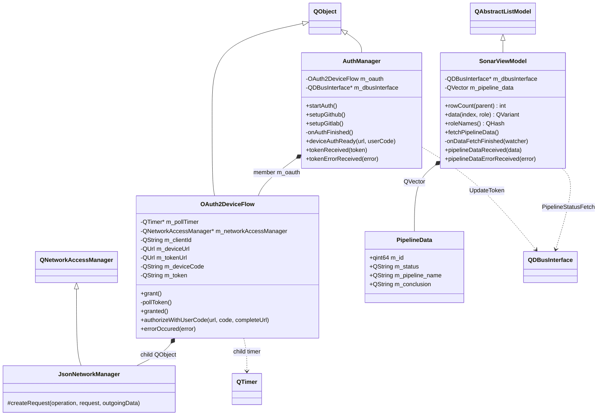
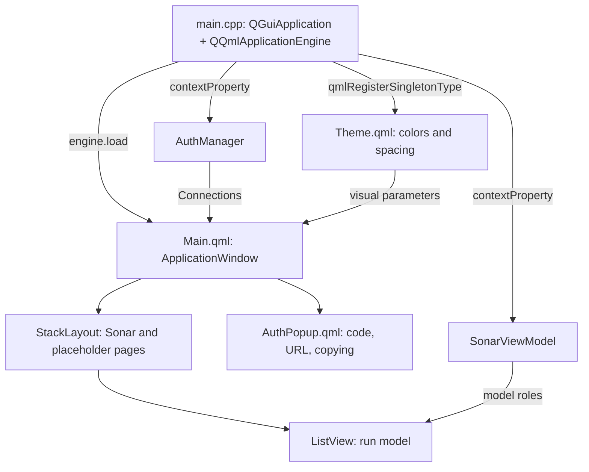

# Deck

**Status:** Active / Prototyping

## Architecture
> ⚠ Architecture is currently under active development and may change significantly between revisions.

## C++ Structural Diagram



The `get*/set*` methods in `OAuth2DeviceFlow` provide access to six configuration/data fields; they are omitted from the diagram for readability. `granted`, `authorizeWithUserCode`, `errorOccured`, `deviceAuthReady`, `tokenReceived`, `tokenErrorReceived`, `pipelineDataReceived`, and `pipelineDataErrorReceived` are Qt signals, not direct calls to consumers.

## QML Structure and Bindings



`main` creates `AuthManager` and `SonarViewModel` as local objects. `setupGithub()` is called by both the `AuthManager` constructor and `main`. If creating the root QML object fails, the application exits with `-1`.

| HLD Block | Contents |
|---|---|
| QML Interface | `Main.qml`, `AuthPopup.qml`, `Theme.qml`; list, authorization, scaling |
| AuthManager | GitHub configuration, starting authorization, passing the token to Sonar |
| OAuth2DeviceFlow | Device code request, periodic token requests |
| SonarViewModel | Asynchronous D-Bus call, converting JSON into a list model |
| GitHub OAuth | External URLs; HTTP requests are made by `JsonNetworkManager` within Deck |
| Sonar | External service on the D-Bus system bus |

## Authorization

```mermaid
sequenceDiagram
  participant ui as QML
  participant auth as AuthManager
  participant oauth as OAuth2DeviceFlow
  participant github as GitHub OAuth
  participant sonar as Sonar
  ui->>auth: startAuth()
  auth->>oauth: grant()
  oauth->>github: POST /login/device/code, client_id
  github-->>oauth: user_code, verification_uri, device_code, interval
  oauth-->>auth: authorizeWithUserCode
  auth-->>ui: deviceAuthReady; open AuthPopup
  loop Timer interval + 1 second
    oauth->>github: POST /login/oauth/access_token
    github-->>oauth: access_token or error
  end
  oauth-->>auth: granted; timer stopped
  auth->>sonar: UpdateToken("Github", token), synchronously
  sonar-->>auth: bool or D-Bus error
  auth-->>ui: tokenReceived, even if D-Bus fails
```

Requests to GitHub pass through `JsonNetworkManager`, which adds `Accept: application/json`, `User-Agent: Deck`, and `X-GitHub-Api-Version: 2022-11-28`. It logs the response status and body. The token request contains `client_id`, `scope=repo user`, `device_code`, and `grant_type`; the code request contains only `client_id`. Responses and parameter placement are described as they appear in the code, without assumptions about permissions granted by GitHub.

`AuthPopup` opens the URL via `Qt.openUrlExternally` and copies the code through a hidden `TextEdit`. A timer in the window changes the copy button label for two seconds; this is a separate visual timer, not OAuth polling.

## Fetching Runs

1. The `Refresh` button calls `SonarViewModel::fetchPipelineData()`.
2. `asyncCall("PipelineStatusFetch")` creates a `QDBusPendingCallWatcher`.
3. A successful `QString` response is converted to JSON. `beginResetModel()` clears the previous data.
4. For an array, `PipelineData` objects are created with `id`, `name`, `status`, and `conclusion`. After `endResetModel()`, `pipelineDataReceived` is emitted.
5. If it is not an array, `endResetModel()` is called, followed by an early return; the model is already empty, and `watcher->deleteLater()` is not called in this branch.
6. A D-Bus error emits `pipelineDataErrorReceived` without resetting the previous model. In the normal branches, the watcher is deleted later.

| Model Role | C++ Field | QML Name |
|---|---|---|
| `IdRole` | `m_id` | `id` |
| `NameRole` | `m_pipeline_name` | `name` |
| `StatusRole` | `m_status` | `status` |
| `ConclusionRole` | `m_conclusion` | `conclusion` |

Both D-Bus clients use `QDBusConnection::systemBus()`, the `org.ars.sonar` service, the `/org/ars/sonar` path, and the `org.ars.sonar.Interface` interface.

## Incomplete and Inconsistent Areas

- `setupGitlab()` is empty; Dashboard, Magfield, and Interlink in QML are placeholders. The `Logs` button has no action handler.
- `OAuth2DeviceFlow::errorOccured` is not connected to `AuthManager::tokenErrorReceived`. Showing a complete error path to QML in the diagram would be fictional.
- `tokenReceived` is emitted even when `UpdateToken` fails. Therefore, `isGithubAuthenticated=true` and the `Connected` label indicate that the signal was received, not a confirmed working connection to Sonar.
- `expired_token` stops the timer; other unhandled token errors and network errors in `pollToken()` have no explicit termination. Repeated `grant()` calls are not guarded by a busy state. A complete OAuth state machine with mutually exclusive states cannot be derived from this code; the table explicitly marks its limits.
- `AuthManager` logs the token directly; `JsonNetworkManager` logs the OAuth response body. Deck has no hidden token store or KWallet integration.
- Deck does not subscribe to `SonarWorkStop` or `SonarCrash`. These arrows between processes must not be added.
