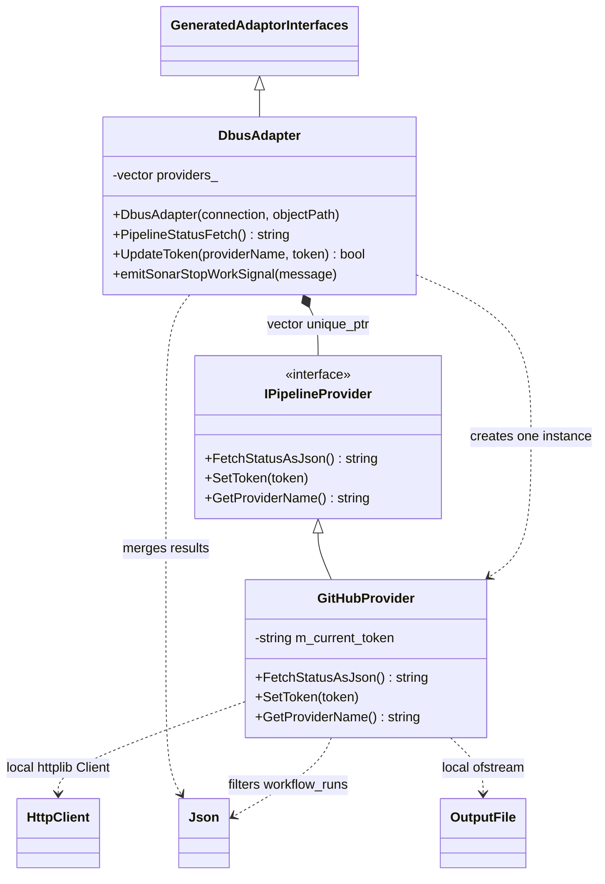
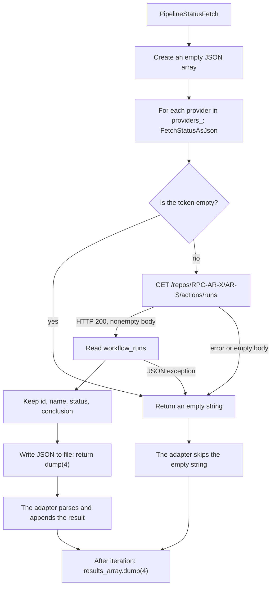
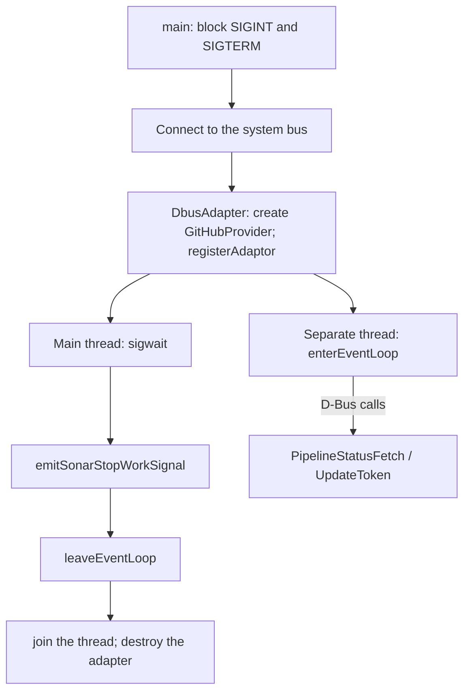

# Sonar

**Status:** Active / Prototyping

## Architecture
> ⚠ Architecture is currently under active development and may change significantly between revisions.

## Structural Diagram

`GeneratedAdaptorInterfaces` is shorthand for `sdbus::AdaptorInterfaces<org::ars::sonar::Interface_adaptor>`. `HttpClient`, `Json`, and `OutputFile` denote the library types `httplib::Client`, `nlohmann::json`, and `std::ofstream`, rather than Sonar's own classes.

| HLD Block | Implementation | Ownership / Purpose |
|---|---|---|
| D-Bus Adapter | `DbusAdapter` | Owns `vector<unique_ptr<IPipelineProvider>>`; registers the adaptor in the constructor and unregisters it in the destructor |
| GitHub Provider | `GitHubProvider` | The only provider actually instantiated; stores the token in memory |
| GitHub Actions | `httplib::Client` | Local client inside `FetchStatusAsJson()` |
| Local File | `std::ofstream` | Writes to the relative path `file` |
| Deck | External client | Calls `UpdateToken`, `PipelineStatusFetch` |

## D-Bus Contract

The implementation uses the **system bus**: `createSystemBusConnection`, service `org.ars.sonar`, path `/org/ars/sonar`, interface `org.ars.sonar.Interface`.

| Member | Input | Output / Behavior |
|---|---|---|
| `PipelineStatusFetch` | None | `s`: JSON array; synchronous iteration over providers |
| `UpdateToken` | `s providerName`, `s token` | `b`: true when the name is found; this does not validate the token with GitHub |
| `SonarWorkStop` | Signal with `s exitMessage` | Emitted during normal shutdown |
| `SonarCrash` | Signal with `s crashMessage` | Declared in XML; no explicit emission call exists in the code |

`statusChanging` is mentioned in the documentation but is absent from the reviewed XML and implementation. The session bus mentioned in the documentation also does not match the code. These elements are not included in the diagrams.

## Data Retrieval

The diagram details the single provider that is actually implemented; the adapter code iterates over a vector. If a provider returns an array, its elements are appended individually; any other JSON value is appended as a single element. A parsing error in the adapter is logged, and iteration continues.

`GitHubProvider` creates a client for `https://api.github.com` and sets a connection timeout of 30 s and a read timeout of 60 s. Headers: `User-Agent`, `Accept: application/vnd.github.v3+json`, `Authorization: token <value>`. The repository is hardcoded. The code contains no pagination, cache, polling scheduler, or other providers.

When `workflow_runs` is absent from otherwise processable JSON, the filtered array remains empty. The `conclusion` field is copied as is, including `null`. HTTP, network, or parsing errors cause the provider to return an empty string. In this case, the adapter may successfully return `[]`, so an empty response does not distinguish between an absence of runs and a retrieval failure.

## Token and Lifecycle

`emitSonarStopWorkSignal` emits the `SonarWorkStop` signal. `UpdateToken` checks the name for an exact match with `"Github"`, calls `SetToken`, and returns true. `SetToken` only assigns the string. An empty value is also accepted. The token is not persisted to disk.

The D-Bus handler performs the HTTP request synchronously in the event loop thread. There is no separate worker thread for fetching statuses. `main` handles `std::exception` by logging it and returning exit code `1`; the code contains no separate daemon recovery mechanism.

## Scope and Limitations

- There is no formal state machine for the domain logic. Minimal token availability states can be inferred from `m_current_token.empty()`; they are described in a separate file, without inventing "authorized" or "error" states.
- The XML contract generates `PipelineAdaptor.h` and `PipelineProxy.h` through CMake; the generated implementations are absent from the repository. The generator's internal behavior has not been reconstructed.
- No system bus access policies were found in the reviewed repository tree. This code does not establish which other local processes can call `UpdateToken`; no access restrictions have been invented in the diagram.
- The result of opening/writing `file` is not checked. This file is auxiliary output, not a source for data recovery.
- `SonarCrash` is not emitted, and Deck does not subscribe to Sonar signals. Notification paths that do not exist are not shown.
